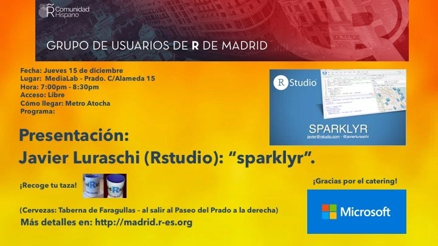

In the last meeting of 2016, the 40th in Madrid’s R Users Group five-year history, we had the opportunity to listen (via Skype) to a very interesting talk by Javier Luraschi, the main author of the package sparklyr.

In our previous meeting, a colleague of the Community (José Luis Cañadas) made a first introduction to sparklyr. José Luis presented the processing capacities of sparklyr on a Spark instance, as well as an interface with the h2o package. His presentation was very well-received, and generated considerable excitement for Javier’s talk.

In his presentation, Javier presented background information and details on the sparklyr package, including how it was conceived and launched, its development scheme, and what is involved in setting up sparklyr on a production cluster. Javier showed how to deploy sparlkyr on Amazon EMR, and how to use RStudio Server to use the machine learning algorithms of the Spark MLlib libraries with dplyr syntax.

Javier covered all these items very thoroughly in his presentation, and also presented the new changes coming with the then forthcoming release (version 0.5 was officially released some days later).

During the Q&A section, Javier provided additional details:
* The intention to continue to support Spark.
* Clarified information about how Cloudera supports sparklyr (Cloudera recommends the use of sparkly with the version of Spark 1.6.2)
 
On behalf of Madrid’s R User Group, we want to thank Javier for his willingness to participate in our meeting, and for his excellent work leading the development with sparklyr.

Note: All sessions of the Madrid’s R User Group are recorded on video. The videos, presentations, and the code of these two meetings can be found (in Spanish) at the URLs given above.
