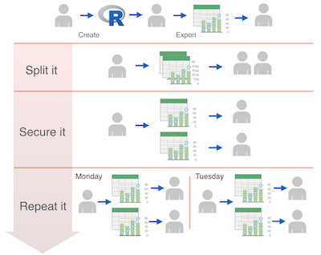
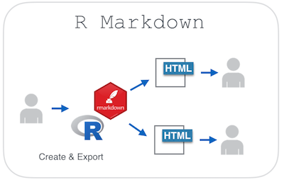

 
In the corporate world, spreadsheets and PowerPoint presentations still dominate as the tools used for analyzing and sharing information. So, it is not at all surprising that even when business analysts use R for the analytical heavy lifting, they frequently revert to using spreadsheets and slide decks to share their results. This may seem like the easiest way to communicate with colleagues, but any modestly complicated project is likely to be error-prone and generate hours of unnecessary rework.

An R-savvy analyst can harness R Markdown to develop reproducible business reporting and information sharing workflows in any business organization; all it takes is a little effort to master some basic R document preparation tools.

In this post, I would like to examine a scenario that represents some experiences I had as an analytics professional.  

## “The report is great but…” Scenario
 

A new R analysis is delivered in a PowerPoint presentation, and everyone thinks that the insights are very valuable. They all want more associates to see it, so almost immediately, the following three requests are made:
 
- **“...we need it broken out by”** - The presentation needs to be split by a specific segment. The segment is normally geographical or managerial in nature.

- **“...they shouldn’t see each others data”** - Since the results are not published in a central publishing platform, it is necessary to create multiple versions of the same report in order to secure the contents.

- **“...we need it every”** - Satisfying requests 1 and 2 may not be too overwhelming if this were meant as a one-time analysis, but usually the analysis and its distribution need to be repeated on a regular interval.

Because we exported the findings into a presentation, sharing results becames more complex and time-consuming if we wish to satisfy the new requirements.

## How can R Markdown help? 

R Markdown combines the creation and sharing steps. The three requests can be satisfied using the following features of R Markdown:

- **Break out the reports** - Using R Markdown's [Parameterized Reports](http://rmarkdown.rstudio.com/developer_parameterized_reports.html) feature, we can easily create documents for each required segment.

- **Automate the file creation** - R Markdown can be run from code, so a separate R script can iteratively run the R Markdown and pass a different parameter for each iteration.

- **Create the slides inside R** - Take advantage of [R Markdown Presentation](http://rmarkdown.rstudio.com/ioslides_presentation_format.html) output to create a slide deck.  Without having to learn a new scripting language, we can code the slide deck and use the same Parameter feature to automate its creation.

- **Keep the interactivity** - In many cases, the end user needs a level of interactivity with the report. This interactivity can be achieved by using [htmlwidgets](http://www.htmlwidgets.org/) inside the R Markdown document.  For example, the [Leaflet](http://www.htmlwidgets.org/showcase_leaflet.html) widget can be used for interactive maps, the [Data Table](http://www.htmlwidgets.org/showcase_datatables.html) widget for interactive tables, and the [dygraphs](http://www.htmlwidgets.org/showcase_dygraphs.html) widget for interactive time series charting.

### Additional benefits

- **Accessible and easy to open** - Any alternative tool needs to be as accessible as the current spreadsheet and presentation tool. R Markdown can output results in [HTML, PDF, and Word](http://rmarkdown.rstudio.com/formats.html). Additionally, the Presentation output uses the highly accessible HTML5 format.

- **Reproducibility** - Copying-and-pasting files, text, or images inevitably introduces human error. In R, data import, wrangling and modeling are already automated, so why not take it to its natural conclusion by using R Markdown to automate the presentation end of the process, as well?

- **Creating a dashboard is easy** - In a spreadsheet, this is normally accomplished with a combination of pivot tables and graphs. R Markdown uses [flexdashboard](http://rmarkdown.rstudio.com/flexdashboard/) to create visually striking dashboards that are self-contained.  By using this in combination with htmlwidgets, the audience gains access to a very powerful tool.

Here is an example of a **live** parameterized R Markdown flexdashboard based on stock data:
 
 

<embed src="http://colorado.rstudio.com:3939/content/239/parameterized-flexdashboard-stock.html", width = "800", height="400"</embed>

## How to get started

**R Markdown is a free package**, so if you have R (and ideally RStudio), you can start using it today. Also, there are a lot of resources available for learning how to use R Markdown; the package’s [official website](http://rmarkdown.rstudio.com/lesson-1.html) is a good place to start.

Here is a sample script that uses Parameterized R Markdown to create a slide deck based on a selected stock. In this case we used Google:

And here is the resulting deck. Press the left arrow key to see the next slide:
 

<embed src="http://colorado.rstudio.com:3939/content/250/Sample_Presentation.html", width = "800", height="400", frameborder="1"></embed>

This simple script creates an nice-looking and interactive deck that needs no manual intervention if the data needs to be refreshed, and one small parameter change if a different stock is to be selected.

## Final thought

We encourage you to try R Markdown yourself. The “start small and then build big” strategy rarely fails, so you could begin by automating a simple report first, and then start taking advantage of more advanced features as you grow comfortable with the tool.
