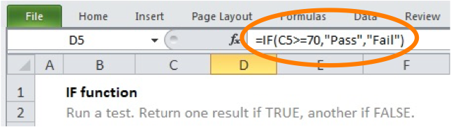
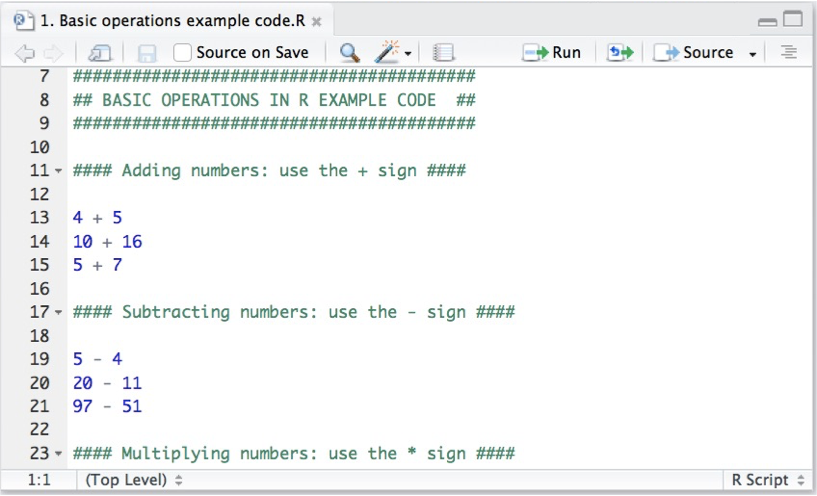
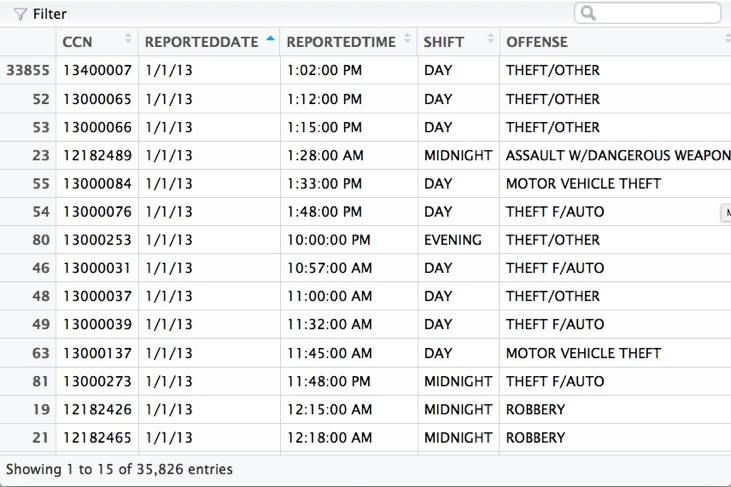
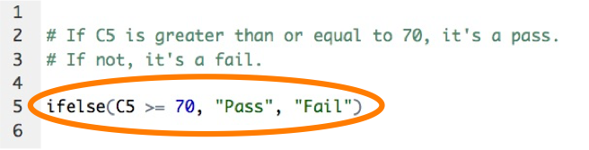
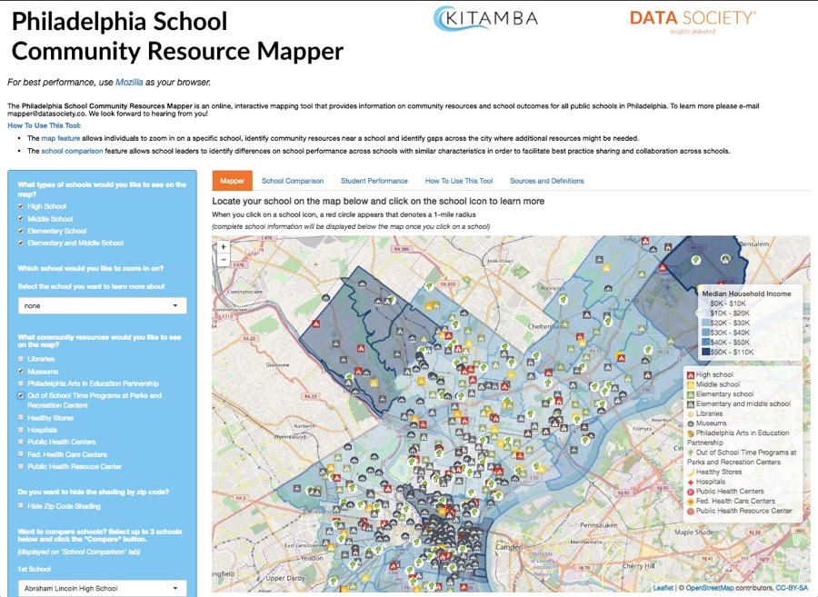

by Merav Yuravlivker, CEO of Data Society

“I’m not a coder” or “I was never good at math” is a frequent refrain I hear when I ask professionals about their data analysis skills. Through popular culture and stereotypes, most people who don’t have a background in programming automatically underestimate their ability to create amazing things with code. However, Data Society has proven that this is a false narrative through our training program – with students in over 20 countries and many government and enterprise clients, we’ve seen so-called “non-coders” proficiently put together automated data cleaning code scripts and analyses within a few weeks. So how do we do it? Well, we’ve singled out three key steps that get someone started on their journey to an amazing skill set and more powerful data analytics: 

1. **Start simple**. My first time training up a group of instructors to teach R programming was a great experience (especially given that these R trainings will train up underserved adults), but it wasn’t without its challenges. Anyone with a non-programming background can feel intimidated when they get started, and it’s critical to start by starting off with R as a glorified calculator. Start with basic operations to get your students comfortable with the interface of RStudio (an awesome and intuitive interface for R), then you can move on to more advanced functionalities.

```{r fig.width=7, fig.height=5,echo=FALSE}
# http://bit.ly/2kOSaw4
library(png)
library(grid)
img <- readPNG("../../static/2017/excel_tips/excel1.png")
 grid.raster(img, x = unit(.55, "npc"))
 # alternate method
#```{r, out.width = "400px"}
#
```

[//]: 
$\qquad$ See? This doesn’t look so complicated.

2. **Show the similarities**. Excel and R do have many similarities in syntax that makes it easier for Excel users to transfer their skills over. For example, RStudio has a tabular data view that may look very familiar to spreadsheet users:

[//]: 

```{r fig.width=7, fig.height=5,echo=FALSE}
library(png)
library(grid)
img <- readPNG("../../static/2017/excel_tips/excel2.png")
 grid.raster(img, x = unit(.55, "npc"))
```  
     
$\qquad$  This looks like another program I’ve used before...

\vspace*{\stretch{2}} And this is not just limited to viewing data. There is a lot of syntax from Excel that is easily transferrable to R. For example, using if-else statements in Excel looks like this:

```{r fig.width=7, fig.height=2,echo=FALSE}
# http://bit.ly/2kOSaw4
#library(png)
#library(grid)
img <- readPNG("../../static/2017/excel_tips/excel3.png")
 grid.raster(img, x = unit(.55, "npc"))
```

$\qquad$ And here is what it looks like in R:

[//]: 

```{r fig.width=7, fig.height=2,echo=FALSE}
# http://bit.ly/2kOSaw4
#library(png)
#library(grid)
img <- readPNG("../../static/2017/excel_tips/excel4.png")
 grid.raster(img, x = unit(.55, "npc"))
```  


The learning curve for R is a fast one, especially for Excel users. Highlighting those similarities puts new users at ease and gives them a way to connect R functionality to the functionality they already use in Excel. 
 
3. **Bring out the wow factor**. One of the main advantages of R is its amazing visualizations and advanced analysis that’s not even possible in many more basic tools. Our “wow factor” is the collaboration project we did with the White House initiative, The Opportunity Project, which aimed to connect federal agencies with tech companies to build out tools with their open data. In a couple of short weeks, our team combined several disparate open data sources and built an interactive application entirely in R to provide schools and superintendents a community resource mapper. 

[//]: 


```{r fig.width=7, fig.height=5,echo=FALSE}
# http://bit.ly/2kOSaw4
#library(png)
#library(grid)
img <- readPNG("../../static/2017/excel_tips/excel5.png")
 grid.raster(img, x = unit(.55, "npc"))     
```  

Showing students how to eliminate duplicates from data sets with 1 – 2 lines of code or quickly manipulating data into a different format is a wow factor in the amount of time it can save regular Excel users. The applications are immediately apparent for those who have struggled to go through thousands of rows or upload a data set with millions of records. 

R is gaining in popularity, with millions of users worldwide and growing. Not only that, but we’ve seen an increase in demand for data analysis skills across all job sectors. Adding R programming and data analysis to your resume can add $10,000 - $15,000 to your salary. With that type of incentive, both in pay and time saved, there’s no better time to take the “not” out of “I’m not a coder”. 

*The [Data Society](https://goo.gl/Alq5nj) is a data science training platform for professionals. Among other government and corporate clients, Data Society has trained staff at the Department of Commerce and the U.S. Army through their enterprise firm, [Data Society Solutions](https://goo.gl/gSj7Ot), which provides customized corporate data science training and consulting services. If you'd like to learn more, please email solutions@datasociety.co.*


