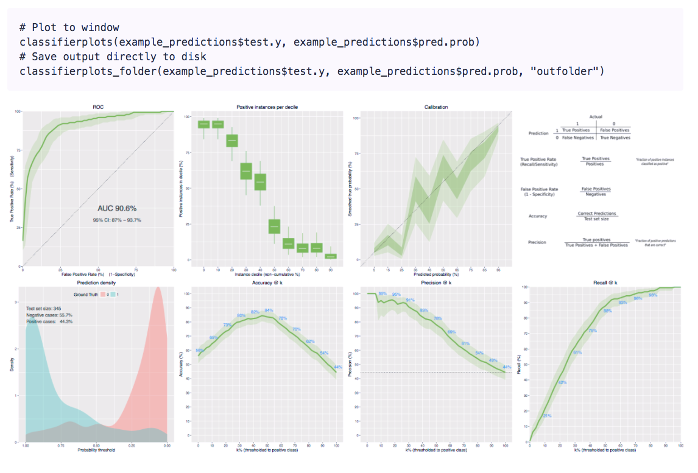
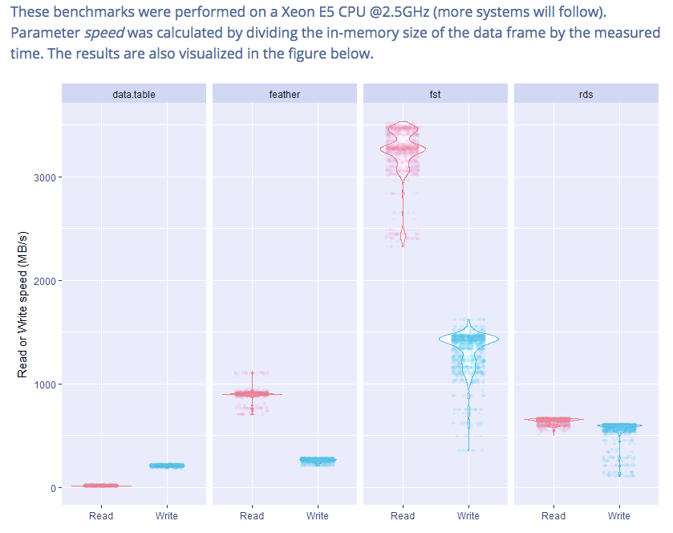

by Joseph Rickert

In a [recent post](https://www.rstudio.com/rviews/2017/02/17/january-new-data-packages/), I highlighted several new package that arrived on CRAN in January that provided R users access to data. In this post, I present additional selections for interesting January packages organized into the categories Miscellaneous, Machine Learning, Statistics and Utilities.

## Miscellaneous
* [rcss](https://cran.rstudio.com/web/packages/rcss/) v1.2: Provides functions for [Solving Control Problems with Linear State Dynamics](https://cran.rstudio.com/web/packages/rcss/vignettes/Practical_User_Guide.pdf).

* [stormwindmodel](https://cran.rstudio.com/web/packages/stormwindmodel/) v0.1.0: Provides functions to calculate wind speeds for hurricanes and tropical storms in the North American Atlantic basin. One [vignette](https://cran.rstudio.com/web/packages/stormwindmodel/vignettes/Details.html) describes the package and [another](https://cran.rstudio.com/web/packages/stormwindmodel/vignettes/Overview.html) shows how to use it.

## Machine Learning
* [crisp](https://www.r-pkg.org/pkg/crisp) v1.0.0: Implements the convex regression with interpretable partitions ([CRISP](http://jmlr.org/papers/volume17/15-344/15-344.pdf)) method of predicting an outcome variable on the basis of two covariates.

* [BayesS5](https://cran.rstudio.com/web/packages/BayesS5/) v1.22: Implements Bayesian Variable Selection Using Shotgun Stochastic Search with Screenning (S5) useful in settings where p >> n. For details, see the [paper](http://www.stat.tamu.edu/~minsuk/publications/nonlocal_sinica7.pdf)

* [classifierplots](https://cran.rstudio.com/web/packages/classifierplots/) v1.3.2: Provides functions to generate a grid of binary classifier and diagnostic plots with a single function call. See the [README](https://github.com/ambiata/classifierplots) for details.

* [eclust](https://cran.rstudio.com/web/packages/eclust/) v0.1.0: Provides and algorithm for clustering high dimensional data that can be affected by an environmental factor. See the [paper](http://biorxiv.org/content/early/2017/01/23/102475) for details.

* [EnsCat](https://cran.rstudio.com/web/packages/EnsCat/) v1.1: Implements various clustering methods for categorical data. See the [web site](https://github.com/jlp2duke/EnsCat/wiki/How-To-with-Examples) for examples and the [paper](https://arxiv.org/pdf/1506.07930.pdf) for the details.

* [MAVE](https://cran.rstudio.com/web/packages/MAVE/) v0.1.7: Implements the  MAVE (Minimum Average Variance Estimation) method of dimension reduction. Look [here](https://cran.rstudio.com/web/packages/MAVE/vignettes/Short_introduction_to_method_MAVE.pdf) for the Math and [here](https://cran.rstudio.com/web/packages/MAVE/vignettes/Short_introduction_to_package_MAVE.pdf) for examples.

* [mfe](https://cran.rstudio.com/web/packages/mfe/): Provides functions to extract meta-features from datasets to support the design of recommendation systems. The [vignette](https://cran.rstudio.com/web/packages/mfe/vignettes/mfe-vignette.html) provides examples.

* [rsparkling](https://cran.rstudio.com/web/packages/rsparkling/) v0.1.0: extends [sparklyr]() with an interface to the [H2O Sparkling Water](https://github.com/h2oai/sparkling-water) machine learning library. [README](https://github.com/h2oai/rsparkling) explains how to use the package.

## Statistics
* [confSAM](https://cran.rstudio.com/web/packages/confSAM/) v0.1: Contains a function that computes estimates and confidence bounds for the false discovery proportion in a multiple testing environment. The [vignette](https://cran.rstudio.com/web/packages/confSAM/vignettes/confSAM.pdf) describes the theory and provides examples/

* [pdSpecEst](https://cran.rstudio.com/web/packages/pdSpecEst/) v1.0.0: Implements a nonparametric, geometric wavelet method to estimate autocovariance matrix of a time series that preserves positive-definiteness of the estimator. This preserves the intrepretability of the estimate as a covariance matrix and helps with computational issues. The [paper](https://arxiv.org/pdf/1701.03314.pdf) describes the theory and the [vignette](https://cran.rstudio.com/web/packages/pdSpecEst/vignettes/vignette.html) provides an example

* [tsdecomp](https://cran.rstudio.com/web/packages/tsdecomp/) v0.2: Implements ARIMA model based decompositions for quarterly and monthly time series data. The [vignette](https://www.jalobe.com/doc/tsdecomp.pdf) describes the Math.

* [TSeriesMMA](https://cran.rstudio.com/web/packages/TSeriesMMA/README.html) v0.1.1: Provides a function to calculate the Hurst surface for a time series. Multiscale, multifractical analysis (MMA) is described in a [paper](http://journals.aps.org/pre/abstract/10.1103/PhysRevE.85.021915) by Gieraltowski et al. 

## Utilities
* [awsjavasdk](https://cran.rstudio.com/web/packages/awsjavasdk/) v0.2.0: Provides boilerplate required to access the classes included in the Amazon Web Services Java Software Development Kit via package rJava. The [vignette](https://cran.rstudio.com/web/packages/awsjavasdk/vignettes/awsjavasdk.html) shows how to use the package.

* [colr](https://cran.rstudio.com/web/packages/colr/) v0.1.900: Provides functions that use Perl regular expressions to select and rename columns in dataframes, lists and numeric types. The [vignette](https://cran.rstudio.com/web/packages/colr/vignettes/colr.html) contains examples.

* [flifo](https://cran.rstudio.com/web/packages/flifo/) v0.1.4: Provides functions to create and manipulate FIFO (First In First Out), LIFO (Last In First Out), and NINO (Not In or Never Out) stacks in R. See the [vignette](https://cran.rstudio.com/web/packages/flifo/vignettes/flifo-vignette.html) for examples.

* [fst]() v0.7.2: Provides functions to read and write data frames at high speed, and compress data with type-optimized algorithms that allow random access of stored data frames.

