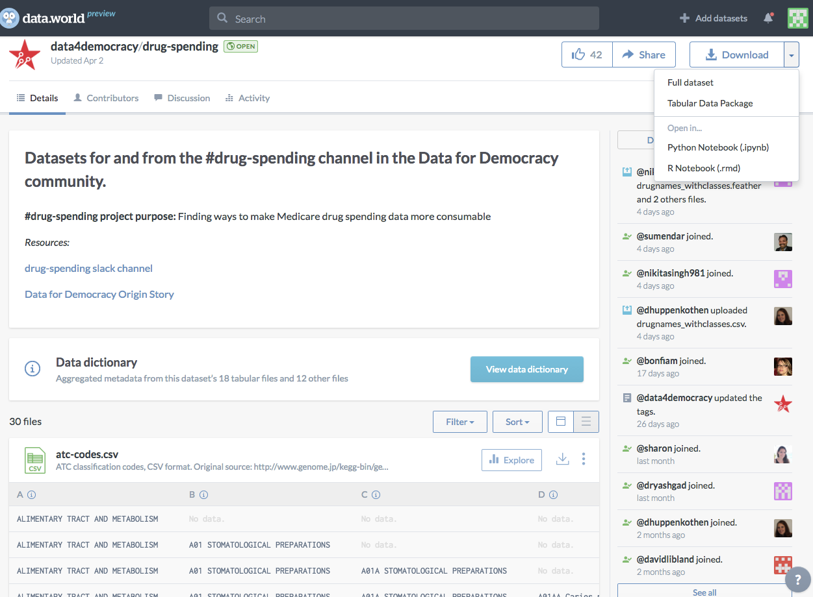

At [data.world](https://data.world/), we are out to solve the “first mile problem of data science”: helping people obtain and understand the data sets they need. Everybody starts here whether they are analyzing their fantasy football league or working on the Zika pandemic. But unfortunately, as Professor Eric Schwartz at the University of Michigan said to me recently: “for so many people, the first mile of data science is the last mile, because people just quit when they see the data.” We have begun by asking these two questions:

What if people who work on data projects could adopt the principles and processes of the open source community? We believe that with transparency, meritocracy and a bottoms-up approach to knowledge management, the world could benefit from the understanding of those who came before them.
What if we could democratize the semantic web and linked data concepts?  Tim Berners-Lee, the creator of HTML and inventor of the hyperlink has envisioned a future where the web links not only documents but data too.  There’s tremendous power in this vision for linked data across the web.  Unfortunately, these concepts are obtuse and not accessible to most people working on data (we are data people after all, and not knowledge engineers).

One group that is using data.world to effectively solve their first mile problem is [Data for Democracy](http://datafordemocracy.org/).  This incredibly diverse group of over 1200 people aims “to be an inclusive community for data scientists and technologists to volunteer and collaborate on projects that make a positive impact on society”.  The [Medicare/Medicaid drug spending project](https://data.world/data4democracy/drug-spending) makes particularly good use of the unique features of data.world datasets by including files of many different formats, [publishing queries](https://data.world/data4democracy/drug-spending/query/94dfc980-5bb7-4190-8696-a40a6e724bfb), and then [building dashboards](https://jenniferthompson.shinyapps.io/shinydashboard-medicared/) using Shiny against the normalized data queried from our [API](https://docs.data.world/documentation/api/). Now their first mile work is captured in an accessible format with clear context, so others will be able to easily and quickly build on it in the future.

Context is king in so many aspects of life, and it’s especially true when you’re working with data. data.world helps you understand the data you are working with by providing a context for datasets that quickly gets you to the who, what, where, when, why and how of the data.  Once you understand the data, we want you to get that data into your tools as quickly as possible with our [APIs and SDKs](https://docs.data.world/), and then get any analysis you’ve done back into data.world for further distribution and discussion.

**Who** - data.world shows you who the contributors are on a dataset, who has liked it and who is commenting.  This allows you to see who is working on this data or project and what other things they work on by browsing their profiles. You can also request to be a contributor if you have something to add!

**What** - What is this data, what can it be used for, what have people done with this data?  Published queries, exploratory visualizations, shared R markdown and notebooks, documentation and analysis all help answer these three critical questions.  Of course, you can use the discussions feature to ask the owners and contributors questions about the data as well.

**Where** - Where did this data come from? In the world of data, this is intrinsically tied to “who.”  In addition to getting all the social context of “who” from our rich profiles, we encourage people to cite the sources of their data in the dataset summary or in further documentation (PDF or Markdown) included in the dataset.  This helps users understand the provenance of the data.

**When** - When has this data changed and when has it been used?  With data.world you can tell when the data was last updated, when analyses were done, and whether people are actively discussing it.  All this helps to determine if the data is suitable to your purpose and, if you’re new to a data, if it still fits in the context of the question you’re asking.

**Why** - Why does this data answer my questions or tell the story it does? Why should I use or trust this data?  We love it when people upload a lot more than just the data and code.  We specifically allow people to add images and documentation to their datasets to tell their data’s story.

**How** - How do I work with this data? How is my data being used by others?  With our shareable and publishable queries and the ability to share source code alongside the raw data, you don’t have to recreate work that others have done.  If you’re a dataset owner, providing the code that operates on the data or sharing a query that cleans or joins the data in interesting ways provides other people a jumping-off point or a way to reproduce your research and test your findings easily.

In a follow up to this article, we’ll show you how to use our [R SDK](https://www.youtube.com/watch?v=VELntRdDtJ4) along with our data normalization features to discover, join and add features to data in R-Studio.  In the interim, if you want to jump in and start using data.world to power your R projects and analyses the way that Data for Democracy is, I recommend checking out this [tutorial](https://data.world/jonloyens/intermediate-data-world) where we show how to link data from the Washington Post with data discovered in data.world using R-Studio.

**About the Author**

Jon Loyens is the Co-Founder and Chief Product Officer of data.world. In a past life, he was the VP of Engineering for Traveler Products at HomeAway, and before that, a VP of Engineering and Director of the Labs group at Bazaarvoice.  As a long-time technology executive in Austin, he has seen the rise of the trends towards data and analytics as a democratizing force. Jon brought A/B testing and data-driven product management to Bazaarvoice and massively expanded the data programs at HomeAway. Jon introduced GitHub to Bazaarvoice and made OSS contribution a major part of their culture. He’s seen the benefits of openness and transparency in software and, at data.world, is bringing the same benefits to open data.

